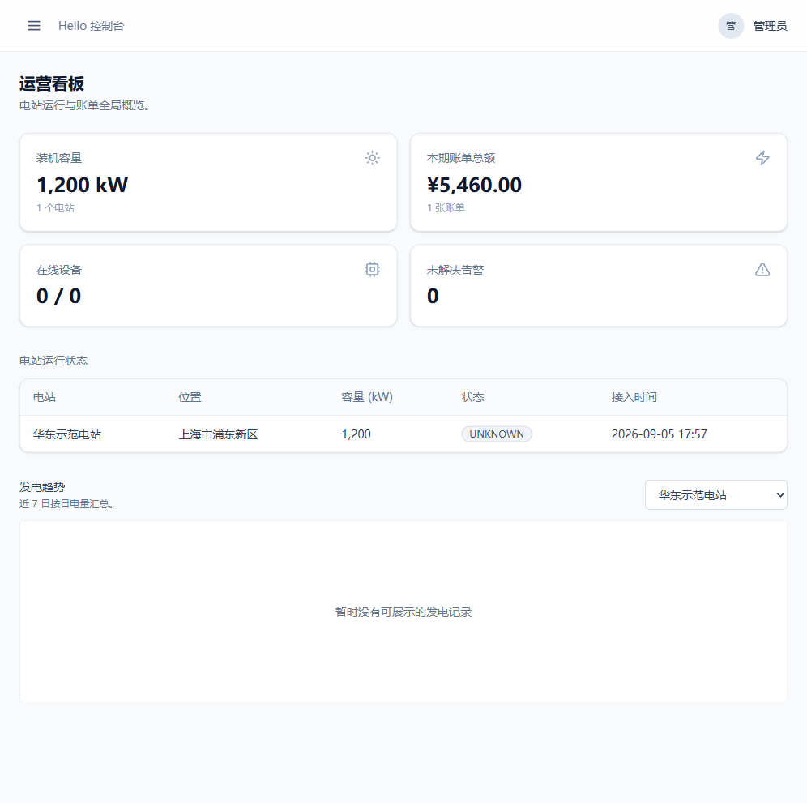
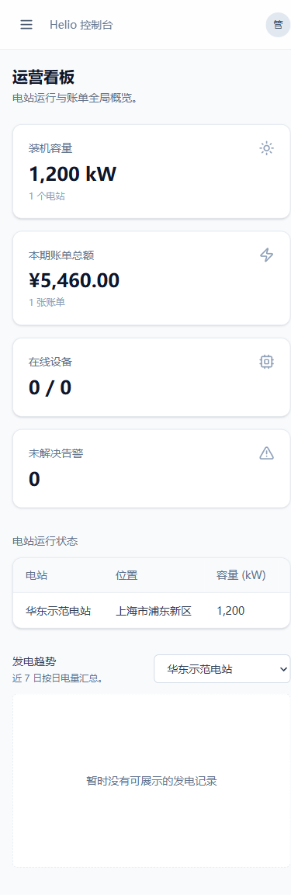
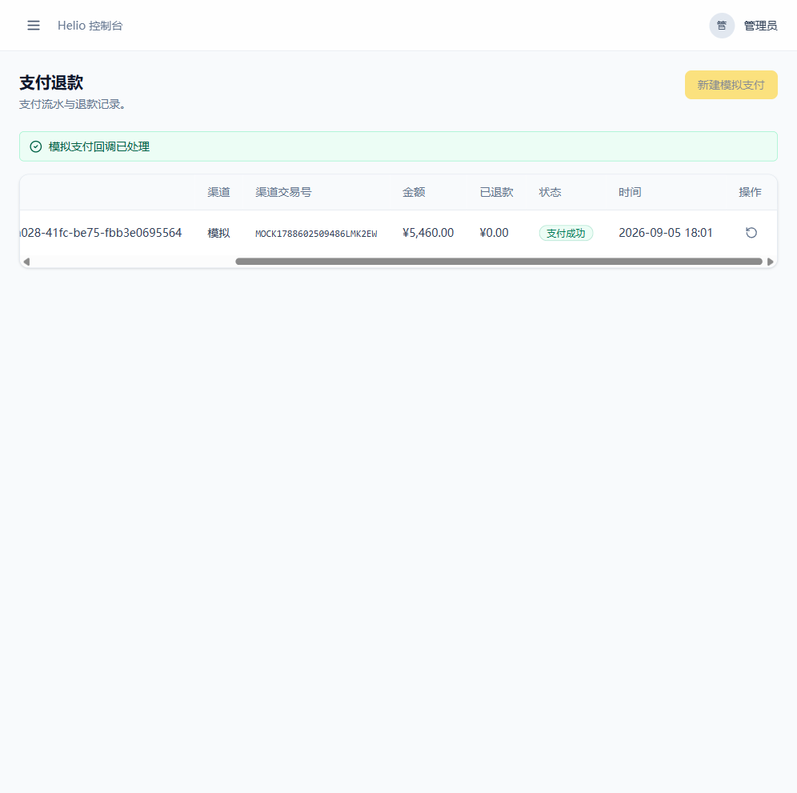

# 展示与交付证据

## 本地可访问入口

| 项目 | 地址 |
| --- | --- |
| Web 控制台 | http://localhost:8080 |
| Swagger | http://localhost:3000/api/docs |
| API readiness | http://localhost:3000/api/health/ready |

公开部署需要授权的托管与 DNS/镜像仓库凭据。当前没有可核验的公网端点，因此本文件不提供占位链接。

## 已验证截图

以下截图于 2026-09-05 在本地 Compose 栈中采集。演示链路为：登录、创建电站、生成并发出账单、创建订单、提交支付、完成 Mock 回调，以及 worker 结算为 `COMPLETED`。

### 桌面控制台

### 移动控制台

### Mock 支付结算

视频可按 [DEMO.md](DEMO.md) 中的 Playwright 录制命令复现。所有支付截图仅反映本地 Mock 渠道，不表示已接入真实微信或支付宝结算。
